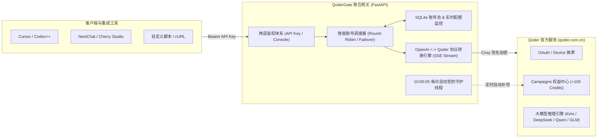

<h1 align="center">QoderGate (QoderGateway)</h1>

<p align="center">
  <strong>将多个 Qoder 账号统一聚合、智能路由、每日全自动签到并无缝转换为标准 OpenAI 兼容接口的高性能网关。</strong><br>
  A high-performance gateway that aggregates multiple Qoder accounts, provides intelligent dispatch, auto daily check-in, and translates upstream services into standard OpenAI-compatible APIs.
</p>

<p align="center">
  = 3.11">
  
  
  
  
  <a href="https://github.com/wangxinleo/QoderGateway/actions/workflows/release.yml"></a>
  <a href="https://linux.do"></a>
</p>

---

## 💡 为什么选择 QoderGate？ / Highlights

- ⚡ **原生 OpenAI 协议兼容**：提供标准 `/v1/chat/completions` 与 `/v1/models` 端点，无缝即插即用接入 **Codex++、Cursor、NextChat、Cherry Studio、ZCode、Chatbox** 等任意客户端。
- 🤖 **14 款顶尖模型矩阵**：内置适配并验证了通义千问 `qwen-3.8-max`、月之暗面 `kimi-k3`、DeepSeek `deepseek-v4-pro`、智谱 `glm-5.3` 等全系列模型，支持任务自适应路由 (`auto`) 与极速单行补全 (`lite`)。
- 🔄 **智能多账号池与负载均衡**：支持批量导入 PAT / Device 凭据，账号按 UID 自动去重。请求失败或额度用尽时自动无缝 Failover 故障转移；支持**全部调用 (默认池)**、**专属单独调用 (仅定向)** 与 **排除调用 (仅签到保活)** 三种模式。
- 🎁 **每日签到全自动守护体系**：严格锚定每日 **10:00:05 (UTC+8)** 官方权益放量周期，后台守护线程全自动为个人账号领取 +100 Credits 算力加油包（30天有效）；智能识别并彻底剔除企业/组织免签账号，统计精准真实。
- 🛡️ **双层安全架构**：管理控制台（WebUI Console）管理口令与对外 API Key 权限完全物理隔离，支持自定义生成多组 Key，并可单独绑定指定调用账号。
- 🎨 **现代化毛玻璃 Web 控制台**：基于 React 18 + Tailwind 构建，内置 Dashboard 系统概览、账号配额透视、API 密钥管理、每日签到中心与实时服务日志，支持中英双语自适应。
- 🐳 **轻量云原生容器化**：开箱即用 Docker Compose 编排，支持宿主机代码卷绑定与秒级热重载，单实例内存占用仅 ~30MB。

---

## 🏗️ 架构拓扑 / Architecture



---

## 🤖 支持模型矩阵 / Model Matrix

网关内置已验证测试的 14 款主流模型（均支持 1M 或 200K 超长上下文）：

| 模型 ID (`model`) | 厂商 | 上下文 | 特性说明 |
| :--- | :--- | :--- | :--- |
| `kimi-k3` ⭐ | 月之暗面 | 1M | 旗舰级首选，超长上下文与复杂代码深度推理 |
| `deepseek-v4-pro` ⭐ | DeepSeek | 1M | 顶级代码架构与逻辑分析，生成严谨扎实 |
| `qwen-3.8-max` ⭐ | 阿里通义 | 1M | 通义全能旗舰，代码与长文本均衡 |
| `glm-5.3` ⭐ | 智谱 GLM | 1M | 最新主力模型，中文语义理解与 Agent 表现出色 |
| `kimi-k2.8` | 月之暗面 | 200K | 高性价比轻巧代码助手，响应迅速 |
| `deepseek-flash` | DeepSeek | 128K | 极速首字响应，低延迟代码补全首选 |
| `qwen-3.8-flash` | 阿里通义 | 1M | 通义极速版，兼具效率与精度 |
| `qwen-3.7-max` | 阿里通义 | 1M | 经典全能模型，长文本稳定性极高 |
| `qwen-3.7-plus` | 阿里通义 | 1M | 均衡兼顾生成速度与上下文深度 |
| `qwen-3.7-flash` | 阿里通义 | 1M | 轻量通义极速版，日常交互首选 |
| `glm-5.3-flash` | 智谱 GLM | 1M | 高速推理模型，高并发低延迟 |
| `glm-5.2` | 智谱 GLM | 128K | 经典主力引擎，运行稳健 |
| `auto` | Qoder 原生 | 1M | 根据输入任务复杂度自动动态调度最优模型 |
| `lite` | Qoder 原生 | 128K | 超轻量极速模型，毫秒级代码单行生成 |

---

## 🚀 快速上手 / Quickstart

### 方式一：Docker Compose 一键部署（推荐）

1. **克隆项目并配置环境**：
   ```bash
   git clone https://github.com/saulgoodgirl/QoderGateway.git
   cd QoderGateway
   cp .env.example .env
   ```

2. **编辑 `.env` 设置管理密码**：
   ```env
   QODER_ADMIN_PASSWORD=your_secure_password
   ```

3. **一键启动服务**：
   ```bash
   docker compose up -d
   ```

服务将在 `http://localhost:5050` 启动完成。

---

### 方式二：本地 Python 原生运行

1. **环境准备与依赖安装**（推荐使用 [uv](https://github.com/astral-sh/uv) 或 Python 3.11+）：
   ```bash
   git clone https://github.com/saulgoodgirl/QoderGateway.git
   cd QoderGateway
   uv sync
   ```

2. **前端静态资源编译**：
   ```bash
   cd frontend
   npm install
   npm run build
   cd ..
   ```

3. **启动网关**：
   - Windows 一键启动：直接双击 `start.bat`
   - 命令行启动：
     ```bash
     uv run qoder2api --port 5050
     ```

---

## 📦 自动发布 / Release Pipeline

推送版本 tag 即自动完成「前端产物校验 → 镜像构建推送 GHCR → 容器启动冒烟 → 创建 GitHub Release」，发版收敛为两条命令：

```bash
git tag v1.0.0
git push origin v1.0.0
```

### 发布流程 / Pipeline Stages

1. **verify**：在干净检出上执行 `npm ci && npm run build` 重建前端，并校验 `src/qoder2api/static/` 与已提交内容完全一致（覆盖 modified / untracked / deleted）；随后执行后端语法门槛 `python -m compileall src/qoder2api`。任何不一致（忘记重建或忘记提交静态产物）都会导致流水线**硬失败**，镜像不推送、Release 不创建。发布前请先本地执行 `cd frontend && npm run build` 并提交产物。
2. **build-and-push**：构建 `Dockerfile` 并推送镜像到 GHCR（并输出本次构建的镜像 digest）。
3. **smoke**：以本次构建的 digest 拉取镜像并启动容器，轮询 `GET /v1/models`（最长 20 秒）确认服务可用；启动失败即触发流水线**硬失败**并输出容器日志与退出状态，**启动失败的镜像不会创建 Release**。
4. **release**：依据 tag 自动创建 GitHub Release（自动生成 release notes）；须 smoke 通过后才会运行。

### 镜像地址与拉取 / Image & Tags

- 镜像仓库：`ghcr.io/wangxinleo/qodergateway`（仅使用内置 `GITHUB_TOKEN` 推拉，无需配置额外 secrets）

```bash
# 拉取最新正式版
docker pull ghcr.io/wangxinleo/qodergateway:latest

# 按版本号固定（生产环境推荐，删除 tag 不会回收镜像）
docker pull ghcr.io/wangxinleo/qodergateway:1.0.0
```

| 触发方式 | 生成镜像标签 | GitHub Release |
| :--- | :--- | :--- |
| 推送 tag `v1.2.3` | `1.2.3`、`1.2`、`latest` | 自动创建 |
| 推送 tag `v1.2.3-rc.1`（预发布） | `1.2.3-rc.1`（不更新 `latest`） | 自动创建 |
| 手动触发 `workflow_dispatch` | `edge` | 不创建 |

### 手动触发与 GHCR 可见性 / Manual Dispatch & Visibility

- **手动触发**：GitHub Actions 页面选择 `release` 工作流 → `Run workflow`（`workflow_dispatch`），用于试跑或重跑，产出 `edge` 标签镜像（不创建 Release）。
- **GHCR 包可见性**：镜像包默认私有（不继承仓库公开性）。如需公开，进入包页面 `Package settings` → `Change visibility` → 改为 `Public`；保持私有则拉取前需 `docker login ghcr.io`。

> [!NOTE]
> 发布流水线只负责构建与镜像分发，不包含自动部署（CD）；服务器更新仍用 `scripts/deploy_remote.py` 手动执行。

---

## ⚠️ 关于自动注册机的特别说明 / Note on Auto Registrar

> [!IMPORTANT]
> **自动注册机仅限本地桌面环境独立使用**：
> 1. **运行机制与 GUI 依赖**：Qoder 账号注册流程包含人机拼图滑块验证（Captcha），底层依赖自动化浏览器并需要调用本地桌面窗口置顶（Windows GUI）由人工滑动验证码拼图完成人机验证。
> 2. **云端生产环境剔除**：为了保持云端生产网关的精简与高可用，线上 Web 控制台已剔除注册机面板入口，避免云端无交互环境下因等待滑块导致任务挂起。
> 3. **本地使用方式**：如需批量自动注册账号，请移步项目内置的独立工具包目录 [`qodergate-register/`](./qodergate-register/)，在本地 Windows 桌面环境直接运行。注册成功后自动导出的凭据 JSON 可在云端 Web 控制台的「账号池 -> 批量导入」中一键无缝入库。

---

## 💻 客户端接入示例 / Client Integration

### 1. Codex++ / Cursor / ZCode 配置

- **API 地址 (Base URL)**：`http://localhost:5050/v1`（若部署在云端请填写对应公网域名）
- **API Key**：控制台中生成的 API Key（如 `qg_live_xxxxxxxx`），若未开启鉴权可任意填写
- **选择模型**：填入 `kimi-k3`、`deepseek-v4-pro` 或 `qwen-3.8-max`

### 2. cURL 命令行实测

```bash
curl http://localhost:5050/v1/chat/completions \
  -H "Content-Type: application/json" \
  -H "Authorization: Bearer YOUR_API_KEY" \
  -d '{
    "model": "kimi-k3",
    "messages": [
      {"role": "user", "content": "用 Python 写一个支持泛型的 LRU 缓存类"}
    ],
    "stream": true
  }'
```

---

## ⚙️ 环境变量全量参考 / Environment Variables

| 环境变量 | 类型 | 默认值 | 说明 |
| :--- | :--- | :--- | :--- |
| `QODER_HOST` | String | `0.0.0.0` | 服务监听 IP 地址 |
| `QODER_PORT` | Int | `5050` | 网关 HTTP 服务端口 |
| `QODER_ADMIN_PASSWORD` | String | `admin` | 管理控制台管理员登录密码 |
| `DB_PATH` | String | `qoder.db` | SQLite 数据库存储绝对/相对路径 |
| `QODER_PROXY` | String | `""` | 可选：出站代理服务器地址（如 `http://127.0.0.1:7890`） |
| `QODER_ENABLE_DOCUMENTS` | Bool | `1` | 是否启用内置 `/documents` 文档百科页面 |
| `QODER_ENABLE_LANDING` | Bool | `1` | 是否启用首页 Landing Page 介绍页 |
| `QODER_PAT` | String | `""` | 可选：容器初次启动无账号时自动导入的环境变量 PAT |

---

## 📂 项目工程结构 / Directory Structure

```text
├── src/qoder2api/          # Python 核心后端
│   ├── app.py              # FastAPI 核心网关与 UI 接口
│   ├── checkin.py          # 10:00 官方 Campaigns 自动签到与算力核算引擎
│   ├── accounts.py         # SQLite 账号池生命周期与调度策略
│   ├── auth.py             # Qoder OAuth 票据保活与 Device 换票
│   ├── bridge.py           # OpenAI Chat Completions 协议双向桥接 (SSE)
│   ├── config.py           # 网关与 API Key 配置持久化
│   ├── database.py         # SQLite 数据层 Schema 与初始化
│   └── static/             # 预编译的前端 SPA 静态资产
├── frontend/               # React 18 + Tailwind 前端控制台源码
│   ├── src/App.tsx         # 控制台核心管理面板
│   └── vite.config.ts      # Vite 构建流水线
├── docker-compose.yml      # Docker Compose 云原生一键编排
├── Dockerfile              # Python 3.11 容器镜像构建文件
├── .env.example            # 环境变量模板文件
├── requirements.txt        # Python 核心依赖清单
├── pyproject.toml          # uv / PEP 517 项目规范
└── LICENSE                 # MIT 开源许可证
```

---

## 🤝 致谢 / Acknowledgments

- 本项目思想早期启发自 [cubk1/qoder2api](https://github.com/cubk1/qoder2api/)，本项目在其基础上采用全异步高性能架构重构，引入了 SQLite 数据驱动、多账号调度矩阵、官方 Campaigns 权益中心全自动签到和现代化 WebUI。
- 感谢 [LINUX DO](https://linux.do) 极客社区的技术氛围与支持。

---

## 📄 开源许可证 / License

本项目采用 [MIT License](LICENSE) 开源许可证。
